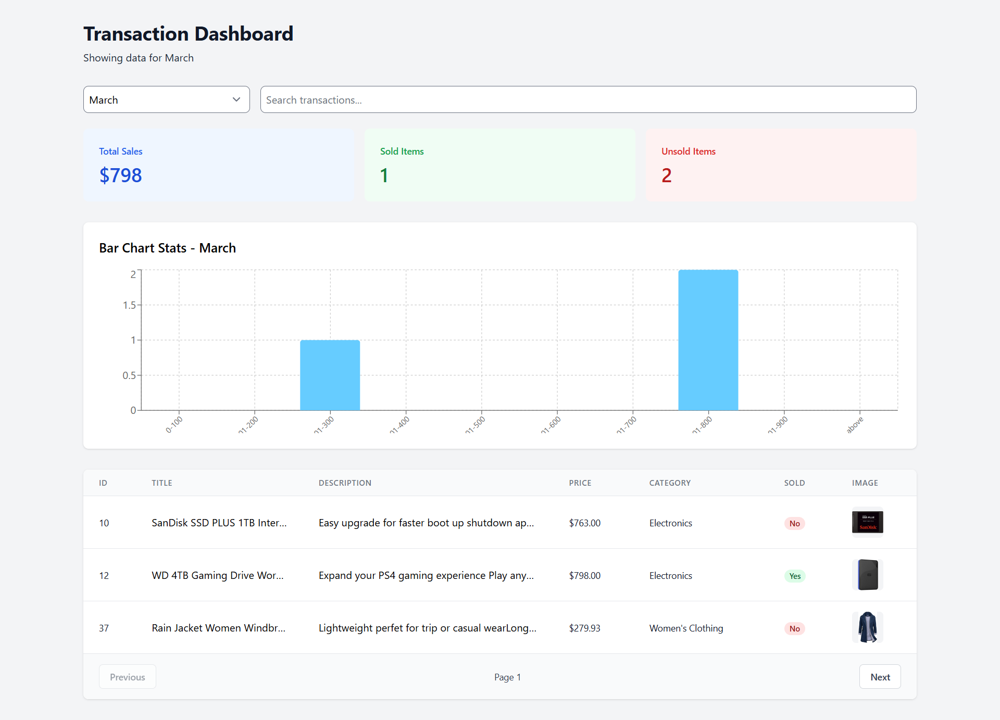

# Transaction Dashboard with Bar Chart and Product Statistics

[](https://transaction-dashboard-six.vercel.app)

A full-stack dashboard application for analyzing transaction data with statistics and visualizations.

## Features

- 📅 Month-based transaction filtering
- 🔍 Search across title/description/price
- 📊 Sales statistics cards
- 📈 Price range distribution chart
- 📄 Paginated transactions table
- 🖼 Product images with lazy loading

## Tech Stack

**Frontend:** React, Tailwind CSS, Axios, Recharts  
**Backend:** Node.js, Express, MongoDB, Mongoose  
**Deployment:** Docker-ready configuration

## Installation

1. Clone repository

```bash
git clone https://github.com/Rohitbadekar-639/roxiler-mern-assignment
cd roxiler-mern-assignment
```

2. Setup backend

```bash
cd backend
npm install
# Create .env file with MongoDB credentials
npm start
```

3. Setup frontend

```bash
cd frontend
npm install
npm start
```

## API Documentation

**Base URL:** `http://localhost:5000/api`

| Endpoint        | Method | Description                        |
| --------------- | ------ | ---------------------------------- |
| `/initialize`   | GET    | Initialize database with seed data |
| `/transactions` | GET    | Get paginated transactions         |
| `/statistics`   | GET    | Get monthly sales stats            |
| `/bar-chart`    | GET    | Get price range distribution       |

## Screenshot


